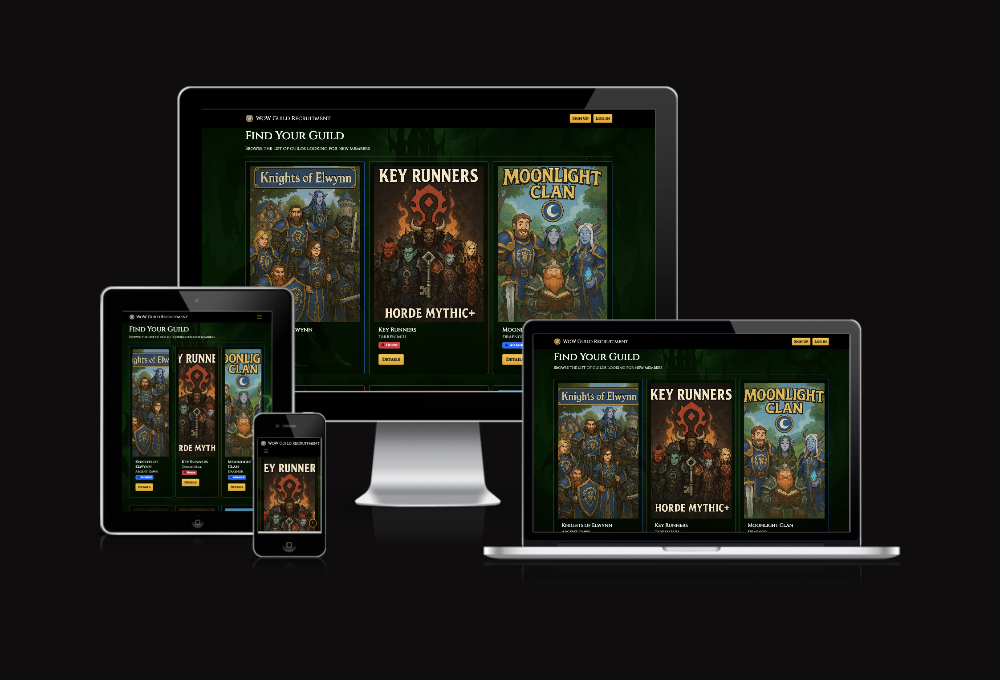
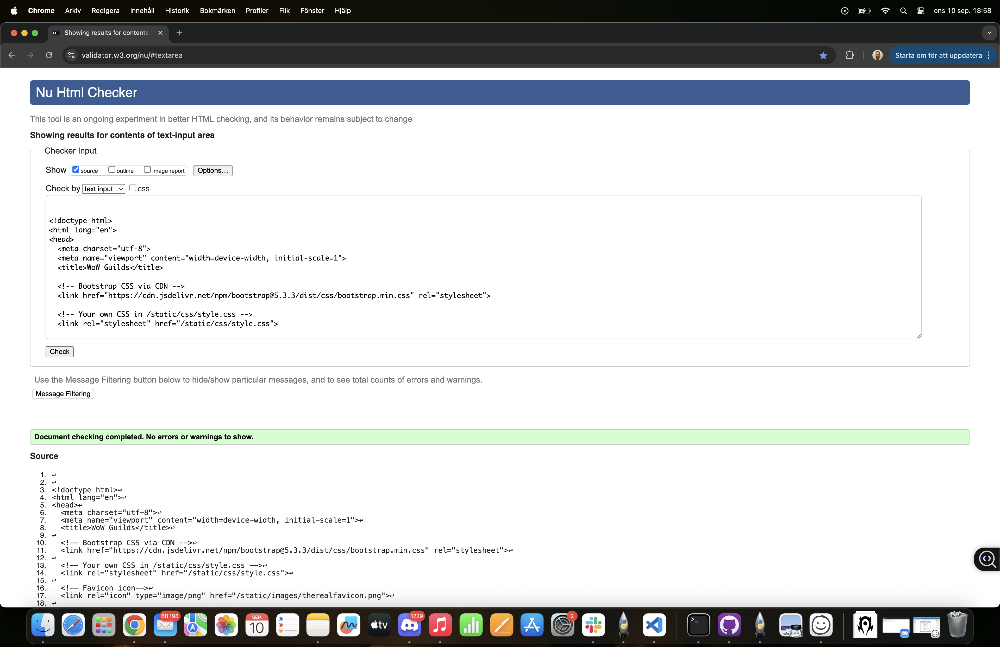
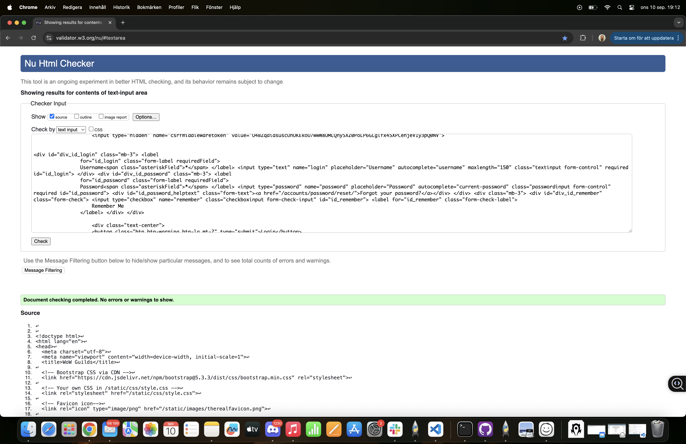
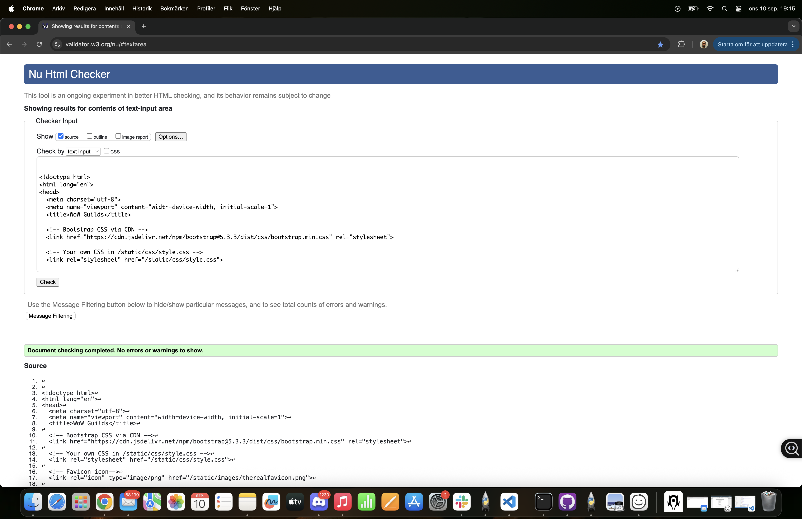
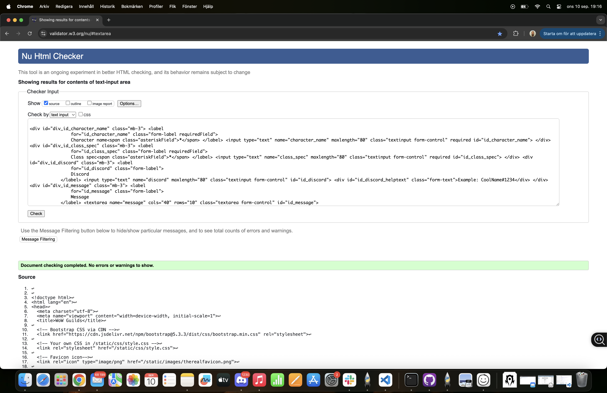
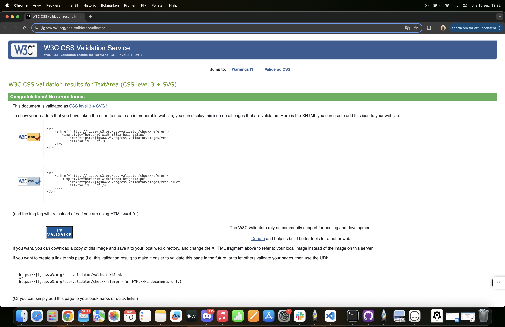
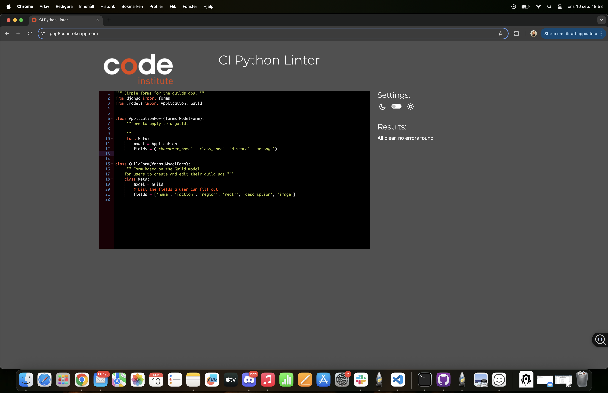
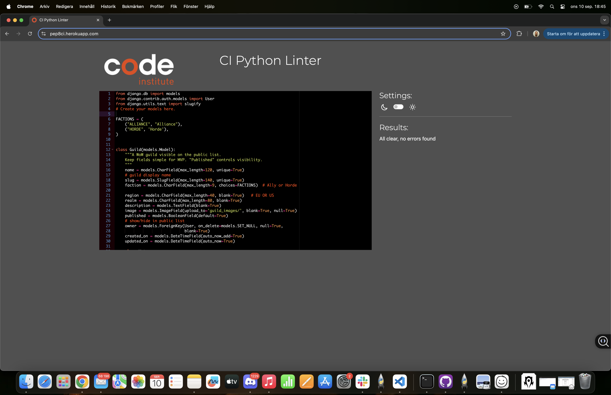
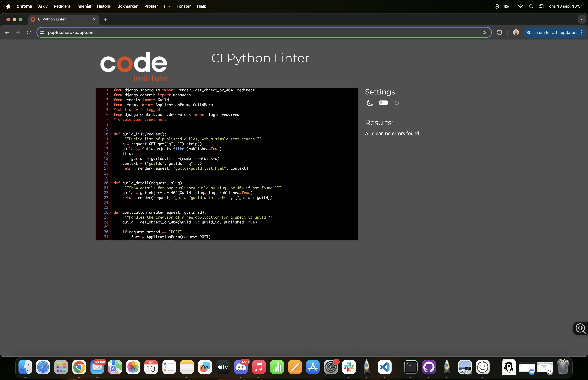

# WoW Guild Recruitment

A full-stack application for World Of Warcraft ("Video Game") players to find and recruit for guilds.
**This is Portfolio Project 3**

## Introduction

World of Warcraft is a social game where players join guilds to play together.
This project is a recruitment site where guild leaders can create ads and players can apply.
The goal is to make it faster and easier to connect the right players with the right guilds.

For many years, World of Warcraft players have said it is hard to find active people to play with.
The game feels less social when guild recruitment is spread across forums, chats, and other websites.

This project was built to fix that problem.
With this site, players can quickly find a guild that fits them, and guild leaders can easily reach new members.
In the future, more features will be added to make recruitment even better, solving many of the issues players 
have talked about for years.

## User Stories

### As a Visitor (Not Logged In)

**US1: View a list of guilds**
> **User Story:** As a visitor, I want to see a list of guilds so I can find options.

**Acceptance Criteria:**
- I can see the guild name, faction, and realm on each card in the list.
- I can click a "Details" button on a card to be taken to that specific guild's page.

**US2: View a guild's detail page**
> **User Story:** As a visitor, I want to open a guild page to read the full details.

**Acceptance Criteria:**
- I can see the guild's detailed description and other information.
- I can see an "Apply" button to start an application.

**US3: Apply to a guild**
> **User Story:** As a visitor, I want to click “Apply” so I can contact the guild easily.

**Acceptance Criteria:**
- I am presented with a simple form to fill out (character name, class/spec, discord, message).
- After submitting the form, I see a success message and am redirected back to the guild's detail page.

**US5: Create an Account or Log In**
> **User Story:** As a visitor, I want to be able to register for an account to create my own ads, or log in if I already have one.

**Acceptance Criteria:**
- I can easily find "Sign Up" and "Log In" links in the navigation bar.
- The registration form allows me to create a new account, which then logs me in.
- The login form allows me to sign in with my existing credentials.

---
### As a Registered User (Logged In)

**US6: Create a Guild Ad**
> **User Story:** As a logged-in user, I want to be able to create a new guild ad.

**Acceptance Criteria:**
- I can find and access a "Create Guild" page.
- After submitting the form, a new guild ad is created and I am listed as the owner.
- I am redirected to the detail page for my new guild ad.

**US7: Edit a Guild Ad**
> **User Story:** As an ad owner, I want to be able to edit the ads that I own.

**Acceptance Criteria:**
- On the detail page of a guild I own, I can see an "Edit" button.
- The edit page shows a form pre-filled with the current guild information.
- When I save the form, the guild's details are updated.

**US8: Delete a Guild Ad**
> **User Story:** As an ad owner, I want to be able to delete the ads that I own.

**Acceptance Criteria:**
- On the detail page of a guild I own, I can see a "Delete" button.
- I am asked to confirm before the ad is permanently deleted.
- Once deleted, the ad no longer appears on the site.

**US9: Upload an Image**
> [cite_start]**User Story:** As an ad owner, I want to be able to upload an image for my guild ad. [cite: 1]

**Acceptance Criteria:**
- The create/edit form has a field for uploading an image file.
- The uploaded image is shown on the guild's card and detail page.

**US10: Log Out**
> **User Story:** As a logged-in user, I want to be able to log out of my account.

**Acceptance Criteria:**
- I can see a "Log Out" link in the navigation bar.
- Clicking the link ends my session and updates the navigation bar to show "Sign Up" and "Log In" again.

---
### As a Site Administrator

**US11: Manage Content via Django Admin**
> **User Story:** As an administrator, I want to manage all guilds and user content in the admin panel.

**Acceptance Criteria:**
- I can log in to the Django Admin area with superuser credentials.
- I can create, view, update, and delete any guild or application from the admin panel.

**US12: Publish/Unpublish a Guild**
> **User Story:** As an administrator, I want to publish or unpublish a guild to control its visibility.

**Acceptance Criteria:**
- When a guild is marked as "published", it appears in the public list on the website.
- When a guild is marked as "unpublished", it is hidden from the public list.

---
### Security & Deployment

**US13: Secure Ad Management**
> **User Story:** As a user, I want to be sure that I cannot edit or delete ads that I do not own.

**Acceptance Criteria:**
- The "Edit" and "Delete" buttons are not visible on ads owned by other users.
- Attempting to go directly to the edit/delete URL for another user's ad results in an error.

**US14: Site Deployment**
> **User Story:** As the site owner, I want the application to be deployed and live on Heroku.

**Acceptance Criteria:**
- The site is live and accessible at its public Heroku URL.
- The live site uses a PostgreSQL database and serves media/static files correctly.

## Features

### User Accounts (powered by django-allauth)
- **Secure User Registration:** Users can create a personal account with a unique username, email, and password. This allows them to create and manage their own guild ads.
- **User Login and Logout:** Registered users can log in to access member-only features and log out securely. The navigation bar updates to reflect the user's logged-in status.
- **Password Reset:** Users who have forgotten their password can request a reset link via email, providing a secure way to regain access to their account.

### Guild Management (CRUD)
- **Create Guild Ad:** Logged-in users can create new guild advertisements through a simple and intuitive form.
- **Read Guilds:** All visitors can browse a list of all published guilds on the homepage. They can click on any guild to view a detailed page with more information.
- **Update Guild Ad:** Users can easily edit the information on the guild ads that they are the owner of.
- **Delete Guild Ad:** Users can permanently delete their own guild ads after a confirmation prompt to prevent accidental deletions.

### Interactivity & User Experience
- **Image Uploads:** Users can upload a custom image for their guild ad, which is hosted externally on Cloudinary.
- **Apply to Guild:** A simple application form allows players to easily send their information (character name, message, etc.) to a guild they are interested in.
- **User Feedback:** Clear success messages are shown to the user after performing important actions, such as creating an ad or sending an application.
- **Responsive Design:** The site is fully functional and visually appealing on all devices, from mobile phones to large desktops, ensuring a consistent user experience.

### Site Administration
- **Full Admin Control:** The site owner has full administrative control over all user-generated content (guilds, applications) via the built-in Django Admin panel.
- **Publish / Unpublish Content:** The site admin can toggle the visibility of any guild ad, allowing for content moderation.

## Data Schema

For this project, I created a database with two main tables to store all the information: one for the guilds and one for the applications.

### The Guild Model
This table holds all the information for a single guild advertisement.

| Field Name    | Field Type        | Description                                  |
|---------------|-------------------|----------------------------------------------|
| `name`        |  `CharField`       | The name of the guild.                       |
| `slug`        | `SlugField`       | A URL-friendly version of the name.          |
| `faction`     | `CharField`       | The guild's faction (Alliance or Horde).     |
| `region`      | `CharField`       | The server region (e.g., EU, US).            |
| `realm`       | `CharField`       | The name of the server.                      |
| `description` | `TextField`       | A longer description of the guild.           |
| `image`       | `ImageField`      | The image that the user uploads.             |
| `published`   | `BooleanField`    | Decides if the ad is visible or not.         |
| `owner`       | `ForeignKey(User)`| Connects the ad to the user who created it.  |
| `created_on`  | `DateTimeField`   | Automatically stores when the ad was made.   |
| `updated_on`  | `DateTimeField`   | Automatically stores when the ad was last edited. |

### The Application Model
This table holds the information for a player's application to a specific guild. It is connected to the Guild model, so each application knows which guild it belongs to.

| Field Name       | Field Type         | Description                                     |
|------------------|--------------------|-------------------------------------------------|
| `guild`          | `ForeignKey(Guild)`| Connects the application to a specific guild.   |
| `character_name` | `CharField`        | The applicant's character name.                 |
| `class_spec`     | `CharField`        | The applicant's class and spec.                 |
| `discord`        | `CharField`        | The applicant's Discord username.               |
| `message`        | `TextField`        | The message the applicant wrote to the guild.   |
| `created_on`     | `DateTimeField`    | Automatically stores when the application was sent. |

## Design Choices

### Theme
The website has a custom theme inspired by the game **World of Warcraft**. The goal was to create a dark, immersive atmosphere that would feel familiar and appealing to the target audience of WoW players. The design aims to be clean and modern, while still capturing the fantasy aesthetic of the game.

### Colour Scheme
- The primary background is a very dark grey to create a comfortable viewing experience in low-light environments, which is common for gaming.
- A prominent accent colour is a vibrant green, reminiscent of the "fel magic" in the game. And Faction border Colours for the guild cards.
- Action buttons and important links use a contrasting yellow/gold colour, which stands out against the dark/green background and mimics the colour of buttons and quests within the game itself.

### Typography
- The main font used for headings is **Cinzel**, sourced from Google Fonts. This serif font was chosen for its classic, epic fantasy feel, which aligns perfectly with the World of Warcraft theme.
- For body text, a standard sans-serif font is used for maximum readability.

### Layout
- The project uses a **responsive, mobile-first** approach to ensure a good user experience on all screen sizes.
- **Bootstrap 5** is used for its powerful grid system, which allows the guild ads to be displayed in a clean card-based layout. The number of columns adjusts automatically depending on the screen width.

## Technologies Used

### Main Technologies
- **HTML5:** For the basic structure of the site.
- **CSS3:** For all the custom styling.
- **JavaScript:** For interactive elements.
- **Python:** For all the backend logic.
- **Django:** The main framework used to build the project.

### Frameworks & Libraries
- **Bootstrap 5:** For the responsive layout and styling of components like buttons and cards.
- **Google Fonts:** To import the "Cinzel" font.
- **django-allauth:** To handle user accounts (sign up, log in, log out).
- **django-crispy-forms:** To style the Django forms.
- **Pillow:** To handle image uploads in Python.
- **Gunicorn:** The server used to run the app on Heroku.
- **Whitenoise:** To serve static files like CSS and JS on Heroku.

### Database & Hosting
- **Heroku:** The platform used to host the live site.
- **PostgreSQL:** The database used on the live site.
- **Cloudinary:** The service used to store user-uploaded images.
- **SQLite3:** The database used for local development.

### Tools
- **Git & GitHub:** For version control.
- **VS Code:** My code editor.
- **Chrome DevTools:** For debugging and testing.

## Credits

### Code & Tutorials
- **Code Institute:** The "I Think Therefore I Blog" walkthrough project was a key reference for the initial Django setup and structure.
- And [https://codeinstitute.s3.eu-west-1.amazonaws.com/PDF/Django%2BCheat%2BSheet.pdf]
- **YouTube Tutorials:** Various tutorials were used to understand specific Django concepts and solve problems.
- **Cheatsheets:** I used cheatsheets for Django, JavaScript, and CSS as quick references.
- **Stack Overflow:** For solutions to specific coding errors and questions.

### Media
- **Sora AI:** The background images and some placeholder photos were generated using Sora AI.
- **WoW Fandom Wiki:** Horde and Alliance logos were sourced from here.

### Acknowledgements
- **AI Assistance:** I used AI assistants like ChatGPT and Grok to help explain concepts more clearly, and improve my knowledge on what i was doing.

## Testing

I tested my project in different ways during development. I did manual testing to make sure all features work as expected, and used online tools to check my code for errors and to test performance.

### Manual Feature Testing

I went through all the user stories to test each feature of the website.

**User Accounts**
- **Feature:** User Registration
- **To Test:** I went to the "Sign Up" page, filled in the form with a new username, email, and password, and clicked the submit button.
- **Expected:** A new user should be created and I should be logged in automatically and sent to the homepage.
- **Result:** This worked as expected.

- **Feature:** User Login & Logout
- **To Test:** I logged out, then went to the "Log In" page and signed in with the user I just created. Then I clicked "Log Out".
- **Expected:** I should be able to log in. The navigation bar should change to show I'm logged in. When I log out, the navigation bar should change back.
- **Result:** This worked as expected.

**Guild Ad Features (CRUD)**
- **Feature:** Create a Guild Ad
- **To Test:** While logged in, I clicked "Create Guild", filled out the form, uploaded an image, and submitted.
- **Expected:** A new ad should be created and show up on the homepage. I should be sent to the detail page for the new ad.
- **Result:** This worked as expected.

- **Feature:** Edit & Delete a Guild Ad
- **To Test:** As the owner of an ad, I went to its detail page. I clicked "Edit", changed some text, and saved. Then I clicked "Delete" and confirmed.
- **Expected:** I should be able to save my changes. When I delete the ad, it should disappear from the site.
- **Result:** This worked as expected.

- **Feature:** Security
- **To Test:** I logged in as one user, and tried to go to the edit URL for an ad created by a different user.
- **Expected:** I should not be able to see the edit page. The site should give me a "Not Found" error.
- **Result:** This worked as expected. The "Edit" and "Delete" buttons were also correctly hidden.

### Validator Testing
- **HTML:** I tested all HTML files with the official W3C Validator. All pages passed without any errors.

    - 
    - 
    - 
    - 
    - 

- **CSS:** I tested my style.css file with the official W3C Jigsaw Validator. It passed without any errors.
    - 

- **Python:** I used a linter in VS Code to make sure my Python code follows the PEP8 style guide.
    - 
    - 
    - 

### Performance and Accessibility
I used Lighthouse in Chrome DevTools to test the performance and accessibility of my live site.

**Desktop Lighthouse Report**
- 

**Mobile Lighthouse Report**
- 

### Responsiveness and Browser Testing
I used Chrome DevTools to check that the site looks good on different devices like mobile phones (iPhone 12 view) and tablets (iPad Air view). All content was readable and easy to use.

I also checked the site on these browsers and found no issues:
- Google Chrome
- Used inkognito mode
- Safari 

### Bugs
There are no known bugs that break the site.

I noticed that the card images can look a bit tall on the mobile view. I decided to leave this as is, because the site is still fully functional and responsive, which was the main goal for the project.

============================================================

