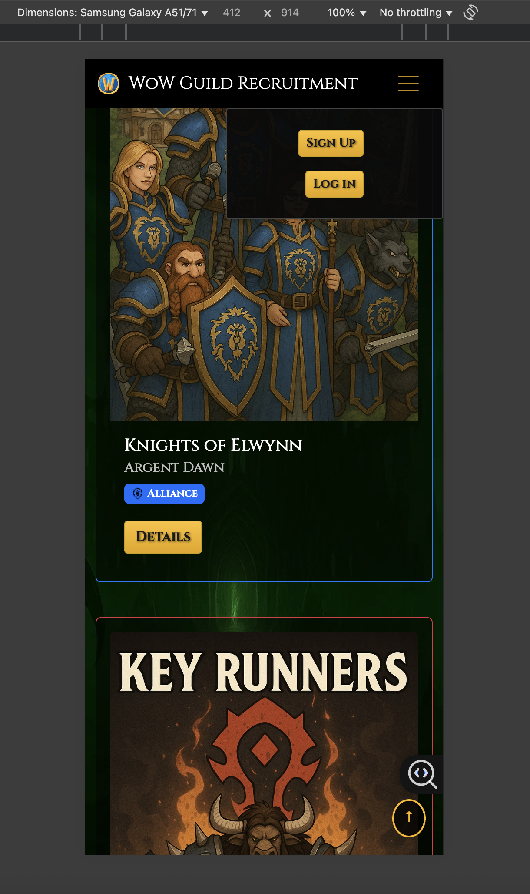

# WoW Guild Recruitment

A full-stack application for World Of Warcraft ("Video Game") players to find and recruit for guilds.
**This is Portfolio Project 3**

## Live Project Links
- **Live Site:** https://wow-guild-recruitment-7eefeb53aa7b.herokuapp.com/
- **Repository:** https://github.com/mathiase4/wow-guild-recruitment

## Table of Contents
- [Introduction](#introduction)
- [User Stories](#user-stories)
- [Agile Planning](#agile-planning)
- [Features](#features)
- [Security](#security)
- [Accessibility](#accessibility)
- [Future Features](#future-features)
- [Data Schema](#data-schema-database-model)
- [Design Choices](#design-choices)
- [Technologies Used](#technologies-used)
- [Testing](#testing)
- [Deployment](#deployment)
- [Environment Variables](#environment-variables)
- [Running The Project Locally](#running-the-project-locally)
- [Wireframes](#wireframes)
- [Known Issues](#Known-Issues)
- - [Credits](#Credits)


## Introduction

World of Warcraft is a social game where players join guilds to play together.
This project is a recruitment site where guild leaders can create ads and players can apply.
The goal is to make it faster and easier to connect the right players with the right guilds.

For many years, World of Warcraft players have said it is hard to find active people to play with.
The game feels less social when guild recruitment is spread across forums, chats, and other websites.

This project was built to fix that problem.
With this site, players can quickly find a guild that fits them, and guild leaders can easily reach new members.
In the future, more features will be added to make recruitment even better, solving many of the issues players 
have talked about for years.


## User Stories

### As a Visitor (Not Logged In)

**US1: View a list of guilds**
> **User Story:** As a visitor, I want to see a list of guilds so I can find options.

**Acceptance Criteria:**
- I can see the guild name, faction, and realm on each card in the list.
- I can click a "Details" button on a card to be taken to that specific guild's page.

**US2: View a guild's detail page**
> **User Story:** As a visitor, I want to open a guild page to read the full details.

**Acceptance Criteria:**
- I can see the guild's detailed description and other information.
- I can see an "Apply" button to start an application.

**US3: Apply to a guild**
> **User Story:** As a visitor, I want to click “Apply” so I can contact the guild easily.

**Acceptance Criteria:**
- I am presented with a simple form to fill out (character name, class/spec, discord, message).
- After submitting the form, I see a success message and am redirected back to the guild's detail page.

  **US4: Back to Top Button**
> **User Story:** As a visitor, I want a "Back to Top" button so I can easily return to the top of the page without scrolling.

**Acceptance Criteria:**
- I can see a small button on the bottom corner of the page when I scroll down.
- When I click the button, the page smoothly scrolls back to the top.
- The button is powered by a simple JavaScript function.


**US5: Create an Account or Log In**
> **User Story:** As a visitor, I want to be able to register for an account to create my own ads, or log in if I already have one.

**Acceptance Criteria:**
- I can easily find "Sign Up" and "Log In" links in the navigation bar.
- The registration form allows me to create a new account, which then logs me in.
- The login form allows me to sign in with my existing credentials.

---
### As a Registered User (Logged In)

**US6: Create a Guild Ad**
> **User Story:** As a logged-in user, I want to be able to create a new guild ad.

**Acceptance Criteria:**
- I can find and access a "Create Guild" page.
- After submitting the form, a new guild ad is created and I am listed as the owner.
- I am redirected to the detail page for my new guild ad.

**US7: Edit a Guild Ad**
> **User Story:** As an ad owner, I want to be able to edit the ads that I own.

**Acceptance Criteria:**
- On the detail page of a guild I own, I can see an "Edit" button.
- The edit page shows a form pre-filled with the current guild information.
- When I save the form, the guild's details are updated.

**US8: Delete a Guild Ad**
> **User Story:** As an ad owner, I want to be able to delete the ads that I own.

**Acceptance Criteria:**
- On the detail page of a guild I own, I can see a "Delete" button.
- I am asked to confirm before the ad is permanently deleted.
- Once deleted, the ad no longer appears on the site.

**US9: Upload an Image**
> **User Story:** As an ad owner, I want to be able to upload an image for my guild ad. 

**Acceptance Criteria:**
- The create/edit form has a field for uploading an image file.
- The uploaded image is shown on the guild's card and detail page.

**US10: Log Out**
> **User Story:** As a logged-in user, I want to be able to log out of my account.

**Acceptance Criteria:**
- I can see a "Log Out" link in the navigation bar.
- Clicking the link ends my session and updates the navigation bar to show "Sign Up" and "Log In" again.

---
### As a Site Administrator

**US11: Manage Content via Django Admin**
> **User Story:** As an administrator, I want to manage all guilds and user content in the admin panel.

**Acceptance Criteria:**
- I can log in to the Django Admin area with superuser credentials.
- I can create, view, update, and delete any guild or application from the admin panel.

**US12: Publish/Unpublish a Guild**
> **User Story:** As an administrator, I want to publish or unpublish a guild to control its visibility.

**Acceptance Criteria:**
- When a guild is marked as "published", it appears in the public list on the website.
- When a guild is marked as "unpublished", it is hidden from the public list.

---
### Security & Deployment

**US13: Secure Ad Management**
> **User Story:** As a user, I want to be sure that I cannot edit or delete ads that I do not own.

**Acceptance Criteria:**
- The "Edit" and "Delete" buttons are not visible on ads owned by other users.
- Attempting to go directly to the edit/delete URL for another user's ad results in an error.

**US14: Site Deployment**
> **User Story:** As the site owner, I want the application to be deployed and live on Heroku.

**Acceptance Criteria:**
- The site is live and accessible at its public Heroku URL.
- The live site uses a PostgreSQL database and serves media/static files correctly.


## Agile Planning 

I worked with Agile methods in a very simple way.

- **User Stories:**  
  I created user stories with acceptance criteria.

- **Project Board:**  
  I used a GitHub Project Kanban board with columns (To Do → In Progress → Done).

- **MoSCoW Priorities:**  
  - **Must have:** CRUD for guilds, register/login/logout, deployment, security.  
  - **Should have:** image upload, success messages.  
  - **Could have:** search, comments, profiles, forum (future).  
  - **Won’t have:** advanced features not needed for this project.

- **Iterations (sprints):**  
  1. Setup project and guild list/detail.  
  2. Authentication and create guild.  
  3. Edit/delete guilds + permissions.  
  4. Image upload and admin publish/unpublish.  
  5. Deployment, testing, documentation.

- **Definition of Done:**  
  A story is finished when the feature works, code is pushed to GitHub, tests pass, and the Issue is closed on the board.


## Features

This section provides an overview of the main features of the website, with screenshots to demonstrate the final product.

### User Accounts (powered by django-allauth)
- **Secure User Registration:** Users can create a personal account with a unique username, email, and password. This allows them to create and manage their own guild ads.
- **User Login and Logout:** Registered users can log in to access member-only features and log out securely. The navigation bar updates to reflect the user's logged-in status.
- **Password Reset:** Users who have forgotten their password can request a reset link via email, providing a secure way to regain access to their account.

  **Log in Page:**
  

  **Sign Up Page:**


**Password Reset Page:**


### Guild Management (CRUD)
- **Create Guild Ad:** Logged-in users can create new guild advertisements through a simple and intuitive form.
- **Read Guilds:** All visitors can browse a list of all published guilds on the homepage. They can click on any guild to view a detailed page with more information.
- **Update Guild Ad:** Users can easily edit the information on the guild ads that they are the owner of.
- **Delete Guild Ad:** Users can permanently delete their own guild ads after a confirmation prompt to prevent accidental deletions.

  **Main Guild List Page:**


**Guild Detail Page:**


**Create/Edit Form:**


### Interactivity & User Experience
- **Image Uploads:** Users can upload a custom image for their guild ad, which is hosted externally on Cloudinary.
- **Apply to Guild:** A simple application form allows players to easily send their information (character name, message, etc.) to a guild they are interested in.
- **User Feedback:** Clear success messages are shown to the user after performing important actions, such as creating an ad or sending an application.
- **Responsive Design:** The site is fully functional and visually appealing on all devices, from mobile phones to large desktops, ensuring a consistent user experience.


  

  **Phone View with the hamburger menu**
  


### Site Administration
- **Full Admin Control:** The site owner has full administrative control over all user-generated content (guilds, applications) via the built-in Django Admin panel.
- **Publish / Unpublish Content:** The site admin can toggle the visibility of any guild ad, allowing for content moderation.


## Security

- **Authentication:** Managed by django-allauth (login, signup, logout).
- **Authorization:** Only the owner can edit or delete their own guild ads.
  - Buttons are hidden in templates for other users.
  - Server-side checks in views block direct access (edit/delete URLs).
- **CSRF:** All forms use ``.
- **Secret keys:** Kept in environment variables (never committed to Git).
- **Production settings:** `DEBUG=False` on Heroku, correct ALLOWED_HOSTS and CSRF_TRUSTED_ORIGINS.
- **Static & media:** whitenoise for static; Cloudinary for user-uploaded images.
- **Validation:** Forms validate input before saving; friendly error messages shown to users.


## Accessibility

- **Semantic HTML:** Proper use of `header`, `nav`, `main`, `footer`, and headings order.
- **Alt text:** Meaningful images include `alt` text.
- **Forms:** Labels and clear error/success messages.
- **Keyboard:** All interactive elements are reachable with keyboard (tab order is logical).
- **Contrast & readability:** Colors checked with Lighthouse; fonts are readable on mobile and desktop.
- **Responsive:** Mobile-first layout with Bootstrap 5 grid.


### Future Features
- **Advanced Search and Filtering:** A more powerful search bar in the navigation that would allow users to filter guilds not just by name, but also by region, faction, and server/realm.
- **User & Character Profiles:** A dedicated profile page where registered users can showcase their main character, including class, specialization, and other relevant details.
- **Comments & Rating System:** A feature to allow players to leave comments or ratings on guild ad pages, providing community feedback.
- **Community Forum:** A simple forum section could be added to allow for more general discussions about the game, finding groups, and other community activities.
- **Connect With Bnet App:** Connect your wow account to your wow-guild-recruitment so you can connect with people directly from the game.


## Data Schema (DataBase Model)

For this project, I created a database with two main tables to store all the information: one for the guilds and one for the applications.

### The Guild Model
This table holds all the information for a single guild advertisement.

| Field Name    | Field Type        | Description                                  |
|---------------|-------------------|----------------------------------------------|
| `name`        |  `CharField`       | The name of the guild.                       |
| `slug`        | `SlugField`       | A URL-friendly version of the name.          |
| `faction`     | `CharField`       | The guild's faction (Alliance or Horde).     |
| `region`      | `CharField`       | The server region (e.g., EU, US).            |
| `realm`       | `CharField`       | The name of the server.                      |
| `description` | `TextField`       | A longer description of the guild.           |
| `image`       | `ImageField`      | The image that the user uploads(handled by Cloudinary.)|
| `published`   | `BooleanField`    | Decides if the ad is visible or not.         |
| `owner`       | `ForeignKey(User)`| Connects the ad to the user who created it.  |
| `created_on`  | `DateTimeField`   | Automatically stores when the ad was made.   |
| `updated_on`  | `DateTimeField`   | Automatically stores when the ad was last edited. |

### The Application Model
This table holds the information for a player's application to a specific guild. It is connected to the Guild model, so each application knows which guild it belongs to.

| Field Name       | Field Type         | Description                                     |
|------------------|--------------------|-------------------------------------------------|
| `guild`          | `ForeignKey(Guild)`| Connects the application to a specific guild.   |
| `character_name` | `CharField`        | The applicant's character name.                 |
| `class_spec`     | `CharField`        | The applicant's class and spec.                 |
| `discord`        | `CharField`        | The applicant's Discord username.               |
| `message`        | `TextField`        | The message the applicant wrote to the guild.   |
| `created_on`     | `DateTimeField`    | Automatically stores when the application was sent. |


## Design Choices

### Theme
The website has a custom theme inspired by the game **World of Warcraft**. The goal was to create a dark, immersive atmosphere that would feel familiar and appealing to the target audience of WoW players. The design aims to be clean and modern, while still capturing the fantasy aesthetic of the game.

### Colour Scheme
- The primary background is a very dark grey to create a comfortable viewing experience in low-light environments, which is common for gaming.
- A prominent accent colour is a vibrant green, reminiscent of the "fel magic" in the game. And Faction border Colours for the guild cards.
- Action buttons and important links use a contrasting yellow/gold colour, which stands out against the dark/green background and mimics the colour of buttons and quests within the game itself.

### Typography
- The main font used for headings is **Cinzel**, sourced from Google Fonts. This serif font was chosen for its classic, epic fantasy feel, which aligns perfectly with the World of Warcraft theme.
- For body text, a standard sans-serif font is used for maximum readability.

### Layout
- The project uses a **responsive, mobile-first** approach to ensure a good user experience on all screen sizes.
- **Bootstrap 5** is used for its powerful grid system, which allows the guild ads to be displayed in a clean card-based layout. The number of columns adjusts automatically depending on the screen width.


## Technologies Used

### Main Technologies
- **HTML5:** For the basic structure of the site.
- **CSS3:** For all the custom styling.
- **JavaScript:** Used for small interactive elements like the "Back to Top" button.
  **The Button**
  
- **Python:** For all the backend logic.
- **Django:** The main framework used to build the project.

### Frameworks & Libraries
- **Bootstrap 5:** For the responsive layout and styling of components like buttons and cards.
- **Google Fonts:** To import the "Cinzel" font.
- **django-allauth:** To handle user accounts (sign up, log in, log out).
- **django-crispy-forms:** To style the Django forms.
- **Pillow:** To handle image uploads in Python.
- **Gunicorn:** The server used to run the app on Heroku.
- **Whitenoise:** To serve static files like CSS and JS on Heroku.

### Database & Hosting
- **Heroku:** The platform used to host the live site.
- **PostgreSQL:** The database used on the live site.
- **Cloudinary:** The service used to store user-uploaded images.
- **SQLite3:** The database used for local development.

### Tools
- **Git & GitHub:** For version control.
- **VS Code:** My code editor.
- **Chrome DevTools:** For debugging and testing.

## Credits

### Code & Tutorials
- **Code Institute:** The "I Think Therefore I Blog" walkthrough project was a key reference for the initial Django setup and structure.
- And [https://codeinstitute.s3.eu-west-1.amazonaws.com/PDF/Django%2BCheat%2BSheet.pdf]
- **YouTube Tutorials:** Various tutorials were used to understand specific Django concepts and solve problems.
- **Cheatsheets:** I used cheatsheets for Django, JavaScript, and CSS as quick references.
- **Stack Overflow:** For solutions to specific coding errors and questions.

### Media
- **Sora AI:** The background images and some placeholder photos were generated using Sora AI.
- **WoW Fandom Wiki:** Horde and Alliance logos were sourced from here.

### Acknowledgements
- **AI Assistance:** I used AI assistants like ChatGPT and Grok to help explain concepts more clearly, and improve my knowledge on what i was doing.


## Testing

I tested my project in different ways during development. I did manual testing to make sure all features work as expected, and used online tools to check my code for errors and to test performance.

### Manual Feature Testing

I went through all the user stories to test each feature of the website.

**User Accounts**
- **Feature:** User Registration
- **To Test:** I went to the "Sign Up" page, filled in the form with a new username, email, and password, and clicked the submit button.
- **Expected:** A new user should be created and I should be logged in automatically and sent to the homepage.
- **Result:** This worked as expected.

- **Feature:** User Login & Logout
- **To Test:** I logged out, then went to the "Log In" page and signed in with the user I just created. Then I clicked "Log Out".
- **Expected:** I should be able to log in. The navigation bar should change to show I'm logged in. When I log out, the navigation bar should change back.
- **Result:** This worked as expected.

**Guild Ad Features (CRUD)**
- **Feature:** Create a Guild Ad
- **To Test:** While logged in, I clicked "Create Guild", filled out the form, uploaded an image, and submitted.
- **Expected:** A new ad should be created and show up on the homepage. I should be sent to the detail page for the new ad.
- **Result:** This worked as expected.

- **Feature:** Edit & Delete a Guild Ad
- **To Test:** As the owner of an ad, I went to its detail page. I clicked "Edit", changed some text, and saved. Then I clicked "Delete" and confirmed.
- **Expected:** I should be able to save my changes. When I delete the ad, it should disappear from the site.
- **Result:** This worked as expected.

- **Feature:** Security
- **To Test:** I logged in as one user, and tried to go to the edit URL for an ad created by a different user.
- **Expected:** I should not be able to see the edit page. The site should give me a "Not Found" error.
- **Result:** This worked as expected. The "Edit" and "Delete" buttons were also correctly hidden.

### Validator Testing
- **HTML:** I tested all HTML files with the official W3C Validator. All pages passed without any errors.

    - 
    - 
    - 
    - 
    - 

- **CSS:** I tested my style.css file with the official W3C Jigsaw Validator. It passed without any errors.
    - 

- **Python:** I used a linter in VS Code to make sure my Python code follows the PEP8 style guide.
    - 
    - 
    - 

### Performance and Accessibility
I used Lighthouse in Chrome DevTools to test the performance and accessibility of my live site.

**Desktop Lighthouse Report**
- 

**Mobile Lighthouse Report**
- 

### Responsiveness and Browser Testing
I used Chrome DevTools to check that the site looks good on different devices like mobile phones (iPhone 12 view) and tablets (iPad Air view). All content was readable and easy to use.

See [Known Issues](#known-issues) for minor visual bugs identified during mobile testing.


I also checked the site on these browsers and found no issues:
- Google Chrome
- Used incognito mode
- Safari
  

### Bugs

I ran into a few issues during development. Here are the two main ones and how I solved them, showing both backend and frontend problem-solving.

- **Fixed Bug: Site Crashing Locally (`ImproperlyConfigured` Error)**
  - **Issue:** My site kept crashing on my local computer when I tried to run it. It gave an `ImproperlyConfigured` error that mentioned Cloudinary.
  - **Cause:** The problem was that my local `env.py` file was missing the `CLOUDINARY_URL`. The site would load pages that didn't have images, but crashed as soon as a page *with* an image tried to load, because it couldn't connect to Cloudinary without the keys.
  - **Fix:** I solved this by adding the correct `CLOUDINARY_URL` to my `env.py` file. This taught me that all environment variables must be set up correctly for all features to work.

- **Investigated Issue: Card Images Look Stretched on Mobile**
  - **Issue:** On mobile and tablet views, I noticed that the images in the guild cards looked very tall and stretched out compared to how they looked on the desktop view.
  - **Cause:** After investigating with Chrome DevTools, I found this was because of how browsers handle images with `width: 100%`. To keep the image's proportions correct, the height would automatically grow a lot when the width of the card became smaller.
  - **Decision:** I tested a fix using CSS `height` and `object-fit: cover` which solved the visual problem. However, I decided that since the site was still fully responsive and the images were clear and not distorted, this was a visual polish issue and not a critical bug. I decided to keep the original, simpler code as it fulfilled the main requirements of the project. This was a good lesson in prioritizing tasks.

## Deployment


This project was deployed to Heroku. I followed these steps to get the site live:

1.  **Create the Heroku App:** I started by creating a new app on the Heroku dashboard.
2.  **Add the Database:** From the "Resources" tab in Heroku, I added the "Heroku Postgres" add-on to create the production database.
3.  **Set Config Vars:** In the app's "Settings" tab, I set the required environment variables (Config Vars):
    - SECRET_KEY: My project's secret key.
    - DATABASE_URL: The URL for the PostgreSQL database (this was added automatically by Heroku).
    - CLOUDINARY_URL: The URL with my API keys for the Cloudinary service.
4.  **Prepare for Deployment:** In my project, I created the necessary files for Heroku:
    - requirements.txt was created using the command pip freeze > requirements.txt.
    - A Procfile was created with the text `web: gunicorn guild_recruit.wsgi`.
5.  **Push to Heroku:** I used Git to push my project code to Heroku. The command used was:
    - `git push heroku main`
6.  **Run Migrations:** After the code was pushed, I ran the database migrations on the Heroku server to set up the tables:
    - `heroku run python manage.py migrate`
7.  **Create a Superuser:** Finally, I created a superuser to be able to access the admin panel on the live site:
    - `heroku run python manage.py createsuperuser`
      
  - **I use environment variables in settings.py to handle the database setup. This makes it easy to switch between SQLite locally and PostgreSQL on Heroku.**

## Environment Variables

To keep my secret keys and other private information safe, I used environment variables. This means the secret keys are not saved in my public GitHub repository.

For my local computer, I created a file called `env.py` to hold these keys. This file is included in the `.gitignore` file so it is never uploaded to GitHub. On the live Heroku site, I used "Config Vars" for the same purpose.

The project needs these variables to work:

**SECRET_KEY - This is Django's secret key for security features.**
**CLOUDINARY_URL - This holds my API keys for the Cloudinary service, so the site knows how to connect to it.**
**DEVELOPMENT - I set this to "True" on my local machine to make the site use the local SQLite database for testing.**
   
  
## Running The Project Locally

### Prerequisites
- Python 3.9+
- Git Version Control
- A code editor such as VS Code

### Installation

1.  **Clone the Repository:**
    git clone [https://github.com/mathiase4/wow-guild-recruitment.git](https://github.com/mathiase4/wow-guild-recruitment.git)
    
    
2.  **Navigate to the Directory:**
    ```Bash
    cd wow-guild-recruitment
    ```
    
3.  **Create and Activate a Virtual Environment:**
    ```Bash
    # For Mac/Linux
    python3 -m venv .venv
    source .venv/bin/activate

    # For Windows (PowerShell)
    py -m venv .venv
    .\.venv\Scripts\Activate.ps1
    ```
    
4.  **Install Dependencies:**
    ```Bash
    pip install -r requirements.txt
    ```
    
5.  **Create the `env.py` file:**
    - Create a new file in the main project folder named `env.py`.
    - Add the following variables. You must provide your own `SECRET_KEY` and `CLOUDINARY_URL`.
    ```python
    import os

    os.environ["SECRET_KEY"] = "replace-with-your-own-secret-key"
    os.environ["CLOUDINARY_URL"] = "replace-with-your-cloudinary-url"
    os.environ["DEVELOPMENT"] = "True"
    ```
    
    *(Note: `env.py` is in `.gitignore` and should never be committed to GitHub).*
6.  **Run Database Migrations:**
    ```Bash
    python3 manage.py migrate
    ```
    
7.  **Create a Superuser (Optional but Recommended):**
    This is needed to access the Django Admin panel.
    ```Bash
    python3 manage.py createsuperuser
    ```
    
8.  **Start the Server:**
    ```Bash
    python3 manage.py runserver
    ```
    
The site will be running at `http://127.0.0.1:8000/`.


## Wireframes

Before I started coding, I created some simple wireframes to plan the basic layout of the site. This helped me think about the structure for both desktop and mobile views.


## Known Issues

- **Mobile Navbar Size**  
  On very small devices (e.g. iPhone 8 viewport 375x667), the navbar appears slightly larger than intended.  
  This can cause the first line of content to sit a bit lower than expected. However, all navigation items are visible and functional.

- **Hamburger Menu Icon**  
  On some small mobile screens, the hamburger icon does not align perfectly in the navbar.  
  Despite this minor visual issue, the menu expands and collapses correctly and navigation works as expected.


## Credits

### Code and Learning
- Code Institute walkthrough project *I Think Therefore I Blog* helped me understand how to set up Django, models, and CRUD.  
- Django Cheat Sheet from Code Institute, used many MANY times to remind me of setup, models, forms, and deployment steps.  
- QuickRef.me Django and Python cheatsheets, used for quick look-ups when I forgot syntax.    
- YouTube tutorials, mainly about Python, Bootstrap, and forms, to understand things better.  

### Media
- Sora AI for some background images and placeholder pictures.  
- WoW Fandom Wiki for Horde and Alliance logos.  
- Fonts from Google Fonts (Cinzel).  

### Acknowledgements
- ChatGPT and Grok AI helped me understand code and explain errors in simple steps.  
- World of Warcraft, Horde and Alliance are trademarks of Blizzard Entertainment. Logos are used only for this school project under fair use.  


---
## Author

- Mathias Eriksson - [GitHub](https://github.com/mathiase4)

## License

This project is licensed under the MIT License.


